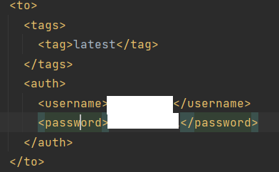
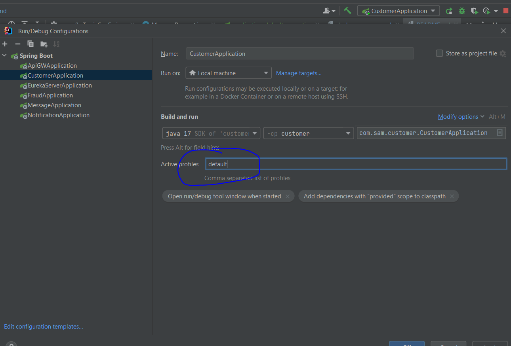

# microservice-configuration

Create the microservice environments for local dev, running on docker containers, deployment on minikubernetes, deployment on cloud kubernetes

There are 4 microservices which are customer register, fraud checker, notification sending and message sending which are managed through Kubernetes.
The 4 microservices run with the support of postgres database, RabbitMq, Kafka and Zipkin which are also containerized and managed through Kubernetes.
So, by default, there are 8 services created in Kubernetes.

- Customer Register and Fraud Check talk to each other through the service name defined by Kubernetes
- Customer register API calls Fraud check API
- And then publish message to Rabbit MQ
- In the meantime, publish the message to Kafka
- The listener in notification read the message from the Rabbit MQ and save data in database
- And the message consumer in Microservice Messages reads data from Kafka and save the data as well.
- Each microservice has its own database.
- All the microservice images are published to the Dockerhub.
- Slueth was introduced for the distributed service tracing
- Zipkin for the trace report display
- The whole enviornment can be deployed in Minikube locally and all the configurations have been done
- Without few changes, the whole environment can be deployed on AWS/AZURE/...

The architecture,

Solutions stack:

- Springboot
- Hibernate
- Postgres Database
- Maven
- RabbitMQ
- Kafka
- Eureka
- Zipkin
- API Gateway
- Docker
- Minikube
- Kubernetes
- Linode

Run microservices locally (Postgres, Rabbitmq, Kafka, Zipkin run in Docker for bootstrap):

- Download the whole project and open the project using IntelliJ
- This project uses some features of JDK Version 17+, please ensure JDK17 has been installed and configured
- Open file "docker-compose.yml", comment the services kafka, zookeeper, customer, notifications, messages, fraud
- Open file "pom.xml" in the root folder, and add your own credential like below

  
- In Terminal, login with your Dockerhub
- Enter into the main project directory
- Run command: mvn clean package -P build-docker-image
- If there are some new versions, run command below to get the latest version. If it's first run, the next step will pull all the related images automatically

  docker pull XXXX
- Run command: docker compose up -d
- Run command: docker exec -it postgres psql -U postgres
- Run command to create 4 database
  create database customer;
  create database notifications;
  create database messages;
  create database fraud;
- Prepare for Kafka enviornment

  - download kafaka: https://www.apache.org/dyn/closer.cgi?path=/kafka/3.3.1/kafka_2.13-3.3.1.tgz
  - enter into the main folder 'kafka_2.13-3.3.1' and start kafka

    .\bin\windows\zookeeper-server-start.bat .\config\zookeeper.properties

    .\bin\windows\kafka-server-start.bat .\config\server.properties
- Start the 4 microservices in IntelliJ

  Before starting the 4 microservices, set the active profile to 'default' in IntelliJ

  
- Test using Postman:
  http://localhost:8080/api/v1/customers
  post
  {
  "firstName":"Tom",
  "lastName":"Jerry",
  "email":"tom_jerry@gmail.com"
  }

Run microservices in local Docker containers:

- Open file "docker-compose.yml"
- In Terminal, login with your Dockerhub
- Enter into the main project directory
- Run command: mvn clean package -P build-docker-image
- Run command: docker pull
- Run command: docker compose up -d
- Run command: docker exec -it postgres -U postgres
- Run command to create 4 database
  create database customer;
  create database notifications
  create database messages;
  create database fraud;
- Run command: docker compose down
- Run command to restart all the containers: docker compose up -d
- Test using Postman:
  http://localhost:8080/api/v1/customers
  post
  {
  "firstName":"Tom",
  "lastName":"Jerry",
  "email":"tom_jerry@gmail.com"
  }
  
  the new version added api key, so before testing in Postman, please add configurations in 'Security->Header', apiKey = supersecure

Run the whole environment on local Kubernetes environment (Minikube):

- Open file "docker-compose.yml"
- In Terminal, login with your Dockerhub
- Enter into the main project directory
- Run command: mvn clean package -P build-docker-image
- Run command: minikube start --memory 4g
- Enter into the folder: /k8s/minikube
- Run command: kubectl apply -f /bootstrap/postgres
- Run command: kubectl get pods
- Run command: kubectl exec -it postgres-0 bash
- Run command: psql -U postgres
- Run command to create 4 database
  create database customer;
  create database notifications
  create database messages;
  create database fraud;
- Run command: kubectl apply -f /bootstrap/zipkin
- Run command: kubectl apply -f /bootstrap/rabbitmq
- Run command: kubectl apply -f /bootstrap/kafka
- Run command: kubectl apply -f /services/customer
- Run command: kubectl apply -f /services/fraud
- Run command: kubectl apply -f /services/notifications
- Run command: kubectl apply -f /services/messages
- Run command: minikube tunnel
- Test using Postman:
  http://localhost:8888/api/v1/customers
  post
  {
  "firstName":"Tom",
  "lastName":"Jerry",
  "email":"tom_jerry@gmail.com"
  }

Run the whole environment on cloud-managed Kubernetes environment:

- Creating the Kubernetes cluster on cloud
- Download Kubeconfig.yml file
- Set local environment variable (use 'export' on Unix, use Environment Setting on Windows )
- Enter into folder /k8s/linode
- Run command: kubectl apply -f /bootstrap/postgres
- Run command: kubectl get pods
- Run command: kubectl exec -it postgres-0 bash
- Run command: psql -U postgres
- Run command to create 4 database
  create database customer;
  create database notifications
  create database messages;
  create database fraud;
- Run command: kubectl apply -f /bootstrap/zipkin
- Run command: kubectl apply -f /bootstrap/rabbitmq
- Run command: kubectl apply -f /bootstrap/kafka
- Run command: kubectl apply -f /services/customer
- Run command: kubectl apply -f /services/fraud
- Run command: kubectl apply -f /services/notifications
- Run command: kubectl apply -f /services/messages
- Test using Postman:
  http://XXXXXXXXX/api/v1/customers
  post
  {
  "firstName":"Tom",
  "lastName":"Jerry",
  "email":"tom_jerry@gmail.com"
  }

Kubernetes configurations:

